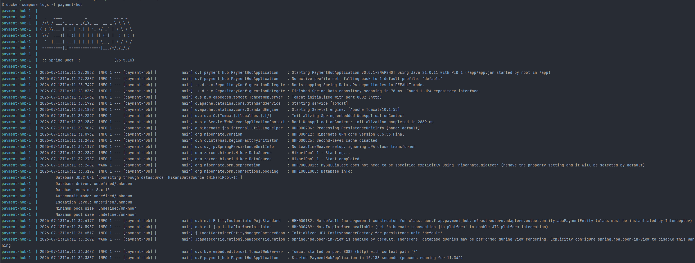
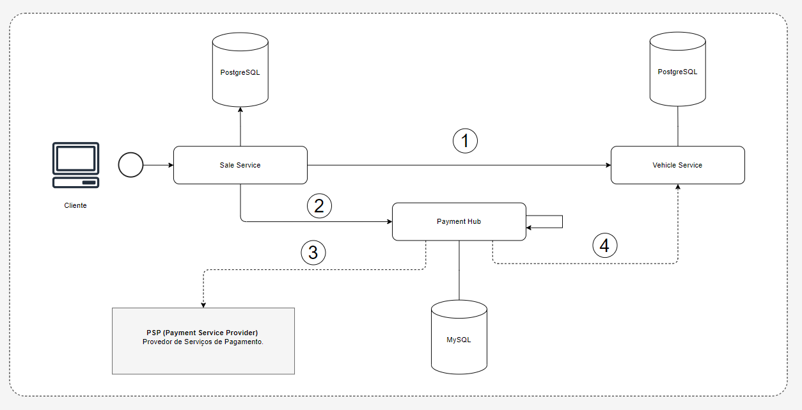
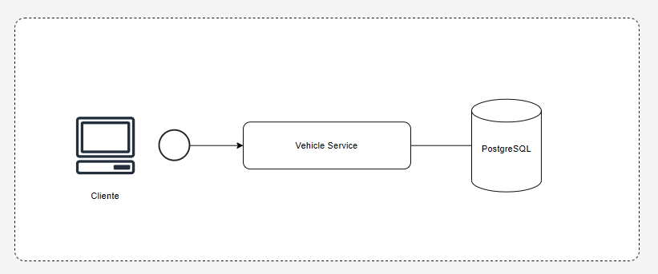
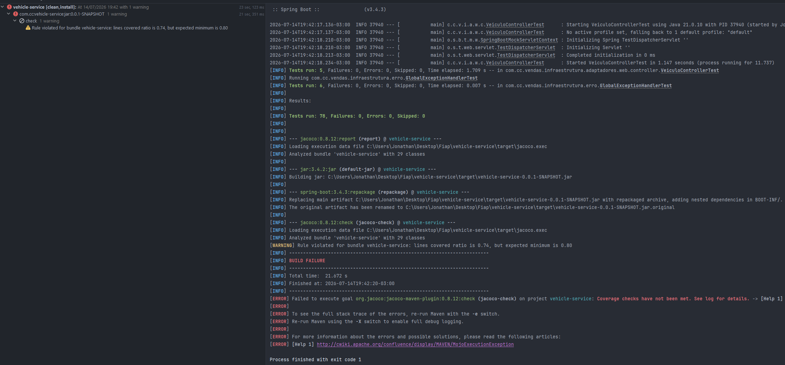
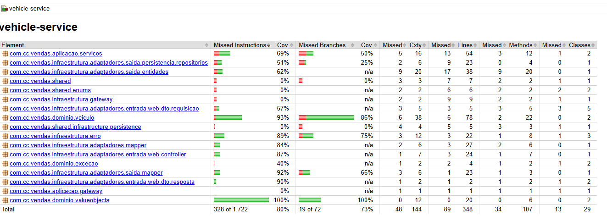

# Sistema de Gerenciamento e Vendas de Veiculos 


Este repositório contém as configurações globais, da orquestração dos contêineres e a documentação geral do projeto.

---

## Problema

O cenário apresentado é de uma empresa de revenda de veículos que necessita disponibilizar uma API para que um frontend possa realizar todo o gerenciamento da plataforma.

Os principais requisitos são:

-cadastrar veículos;

-atualizar os dados de um veículo;

-listar veículos disponíveis para venda;

-listar veículos vendidos;

-registrar a venda de um veículo;

___

## Desenho da Arquitetura

O sistema é construído utilizando uma **Arquitetura de Microsserviços**, com foco em alta disponibilidade, baixo acoplamento e responsabilidades bem definidas. O ecossistema é composto por 4 repositórios principais:

1. **[Repositório de Infraestrutura] (Este repositório):** Responsável por orquestrar o ambiente de desenvolvimento e produção utilizando `docker-compose`. Contém os bancos de dados (PostgreSQL e MySQL), alem das demais dependências.
2. **[Microsserviço de Vendas (Vehicle Sales Service)](https://github.com/jonathanferreira33/sub-IV_FIAP-Sales_Service):** Gerencia o fluxo de criação de vendas, integração com o estoque de veículos e orquestração dos status dos pedidos.
3. **[Microsserviço de Pagamentos (Payment Hub)](https://github.com/jonathanferreira33/payment_hub-sub-IV_FIAP):** Processa as transações financeiras, lida com webhooks de gateways de pagamento e emite eventos de confirmação ou falha.
4. **[Microsserviço de Veículos/Catálogo (Vehicle Service)](https://github.com/jonathanferreira33/sub-IV_FIAP.git ):** Gerencia o estoque, detalhes, disponibilidade e histórico dos veículos.

> **Padrões Adotados:** Arquitetura Hexagonal (Ports and Adapters), Comunicação Síncrona (REST/Feign/RestClient) e Tratamento Global de Exceções.

---

## Pré-requisitos e Tecnologias

Para reproduzir este ambiente na sua máquina local, você precisará ter as seguintes ferramentas instaladas:

* **Java Development Kit (JDK):** Versão 21 (LTS)
* **Maven:** Versão 3.9+ (Para builds locais, caso não utilize o wrapper)
* **Docker e Docker Compose:** Essenciais para subir a infraestrutura e os serviços de forma isolada.
* **Git:** Para o controle de versão.
* **IDE Recomendada:** IntelliJ IDEA (com os plugins de suporte ao Spring e Lombok ativados).

---

## Como Executar o Ambiente Local

A orquestração local é feita inteiramente via Docker. O arquivo `docker-compose.yml` presente neste repositório, que está configurado para iniciar os bancos de dados e as imagens dos três microsserviços.

1. **Clone este repositório de infraestrutura:**

```bash
   git clone https://github.com/jonathanferreira33/FIAP_vehicle-platform-infra.git infra-rm358768
   cd infra-rm358768
```

2. Inicia e valide o seu ambiente

``` bash
    docker-compose up --build -d
```

em seguida valide cada um dos serviços:

``` bash
    docker compose logs -f payment-hub
    docker compose logs -f vehicle-sales-service
    docker compose logs -f vehicle-service
```

Para todos os micro serviços uma imagem parecida com a abaixo deve ser observada: 




(Nota: Cada repositório conta com o README individual de cada microsserviço., mas deixo nesse repositório um arquivo com o nome: para download das colection gerada no software Insomnia)

___


## Integração entre os Serviços

A comunicação entre os microsserviços foi desenhada para garantir consistência de dados sem criar um acoplamento forte. Utilizamos uma abordagem híbrida: **Comunicação Síncrona** (REST) para operações de leitura e comandos imediatos, e **Webhooks/Eventos** para consolidação de estados assíncronos.

### 1. Comunicação Síncrona (REST via Spring RestClient)
O serviço de **Vendas** atua como o orquestrador principal do fluxo de compra. Ele se comunica diretamente com os outros domínios através de Gateways HTTP dedicados:

* **Vendas ➡ Veículos (`VeiculoGateway`):**
    * **GET `/veiculos/{idVeiculo}`:** Antes de iniciar uma venda, o serviço consulta o catálogo para validar a existência do veículo, obter detalhes (marca, modelo, ano) e, principalmente, o preço atualizado.
    * **PATCH `/veiculos/{id}/status`:** Após a confirmação do pagamento, o serviço de vendas emite um comando para que o serviço de veículos altere o status do carro no catálogo (marcando-o como vendido e vinculando o ID do pagamento).

* **Vendas ➡ Pagamentos (`PagamentoGateway`):**
    * **POST `/pagamentos`:** Ao registrar uma intenção de compra, o serviço de vendas solicita ao hub de pagamentos a geração de uma cobrança (com suporte a PIX, Cartão, etc.), repassando o ID da Venda e o valor correspondente.



1. Consulta Disponibilidade
2. Solicita Cobrança
3. Conecta com serviços externos provedores de pagamento (MOCK)
4. Atauliza serviço de pagamento e gerenciamento de veiculo

### 2. Atualização de Estado Assíncrona (Webhooks)
Para evitar que o cliente fique travado esperando o processamento de um pagamento, atendendo um dos requisitos do projeto, adotei um fluxo reativo:

* **Webhook de Confirmação (`ProcessarWebhookPagamentoUseCase`):**
  O serviço recebe notificações (Webhooks) com as mudanças de estado do pagamento (ex: `CONFIRMADO`, `CANCELADO`).
    * **Se Confirmado:** O sistema consolida a venda no banco de dados e aciona automaticamente o `VeiculoGateway` para baixar o veículo do estoque.
    * **Se Cancelado/Rejeitado:** A venda é invalidada e o veículo retorna para o estado de disponível.

### 3. Gerenciamneto de estoque de veiculo
  Com o objetivo de garantir maior disponibilidade das informações relacionadas ao estoque de veículos, foi disponibilizado um microsserviço dedicado ao gerenciamento do estoque de veículos, responsável pelo cadastro e pela consulta de veículos disponíveis para venda e de veículos já vendidos.

  

### 4. Resiliência e Tratamento de Falhas
Todas as integrações externas possuem tratamento de exceções para evitar que a queda de um serviço derrube o ecossistema inteiro:
* Erros de negócio (`400 Bad Request`, `404 Not Found`) são mapeados para exceções de domínio claras (ex: `VeiculoNaoEncontradoException`, `PagamentoInvalidoException`).
* Erros de conectividade (`ResourceAccessException`) geram exceções de indisponibilidade (`PagamentoServiceIndisponivelException`), permitindo que a aplicação saiba diferenciar uma regra de negócio quebrada de um serviço fora do ar.

___

## Testes

  Todos os serviços utilizam o padrão AAA (Arrange, Act, Assert) em seus testes unitários, pois ele estrutura os testes de unidade dividindo a lógica em três etapas de interpretação.

#### Estrutura AAA

1. Arrange (Preparar): Aqui os objetos são criados, definimos as variáveis e programamos o comportamento dos mocks.

2. Act (Agir / Executar): É a chamada exata do método que você quer testar.

3. Assert (Verificar / Validar): É onde onde colhemos os resultados da sua ação e verificamos se as coisas aconteceram como deveriam (checando retornos, testando exceções e garantindo que outros métodos foram chamados).

``` java
@Test
    void execute_DeveRetornarPaymentResponse_QuandoPagamentoExistir() {
        // arrange
        when(paymentRepository.findById(paymentId)).thenReturn(Optional.of(mockPayment));

        try (MockedStatic<PaymentAppMapper> mapperMock = mockStatic(PaymentAppMapper.class)) {
            mapperMock.when(() -> PaymentAppMapper.domainToResponse(mockPayment))
                    .thenReturn(mockPaymentResponse);

            // act
            PaymentResponse result = findPaymentByIdService.execute(paymentId);

            // assert
            assertNotNull(result);
            assertEquals(mockPaymentResponse, result);
            
            verify(paymentRepository, times(1)).findById(paymentId);
            mapperMock.verify(() -> PaymentAppMapper.domainToResponse(mockPayment), times(1));
        }
    }
```

Afim de atender um dos requisitos do projeto, cobertura de testes de pelo menos 80%, utilizei um recurso simples, porem eficiente: a configuração do goal de check do JaCoCo no arquivo pom.xml de cada projeto

``` yml
				<execution>
					<id>jacoco-check</id>
					<goals>
						<goal>check</goal>
					</goals>
					<configuration>
						<rules>
							<rule>
								<element>BUNDLE</element>
								<limits>
									<limit>
										<counter>LINE</counter>
										<value>COVEREDRATIO</value>
										<minimum>0.80</minimum>
									</limit>
								</limits>
							</rule>
						</rules>
					</configuration>
				</execution>
```

O trecho de código acima é um recurso conhecido como Quality Gate, aqui definimos a regra de cobertura minima a ser atinginda afim de fazer o Maven falhar o build automaticamente. Abaixo uma demonstração da regra impedindo o build:



A mensagem "BUILD FAILURE" é exibida alem da outra ao lado esquerdo superior informando que a cobertura ficou abaixo dos 80%. Outros detalhes são vistos no relatório do Jococo disponivel no arquivo "...\vehicle-service\target\site\jacoco\index.html"



___

## Integração e Entrega Contínuas (CI/CD)

Adotei práticas de CI/CD para garantir a qualidade e a estabilidade do código entregue. A esteira automatizada é construída utilizando o serviço GitHub Actions.

#### Pipeline de Integração (Pull Requests / Pushes)
Sempre que um novo código é enviado para as branchs principais ou um pull request é aberto, a esteira executa automaticamente os seguintes passos:

1. Setup do ambiente: Provisiona um ambiente Ubuntu com JDK 21.

2. Build da aplicação: Valida a compilação do código (mvn clean package -DskipTests).

3. Execução de testes unitários: Executa todos os testes usando JUnit 5 e Mockito (mvn test).

4. Geração de relatório de Cobertura (Jacoco): Valida se a cobertura de testes atende ao limite mínimo exigido de 80%. O build falha caso a cobertura seja inferior ao limite.

5. Quality gate: Bloqueia merges para a main se qualquer teste falhar ou a compilação quebrar.

### Roadmap
- [ ] Implementar sistema autenticação via OAuth2
- [ ] Implementar sistema de logs centralizados
- [ ] Criar serviço exclusivo para Webhook centralizar as diversas atualizações sobre venda, pagamento e estoque
- [ ] Melhorar a cobertura de testes unitários para todos os serviços

### Comandos uteis Docker

``` docker
docker compose down -v

docker compose up -d --build

docker compose logs -f payment-hub
docker compose logs -f vehicle-sales-service
docker compose logs -f vehicle-service

docker exec -it sub-iv_infra-postgres-db-1 psql -U user -d vehicle_db 
\dt
SELECT * FROM tb_vendas_veiculo;
SELECT * FROM tb_veiculos;
SELECT * FROM tb_pagamentos ;

docker exec -it sub-iv_infra-mysql-db-1 mysql -u root -prootpassword payment_db
SHOW TABLES; 
SELECT * FROM tb_payments;
```

